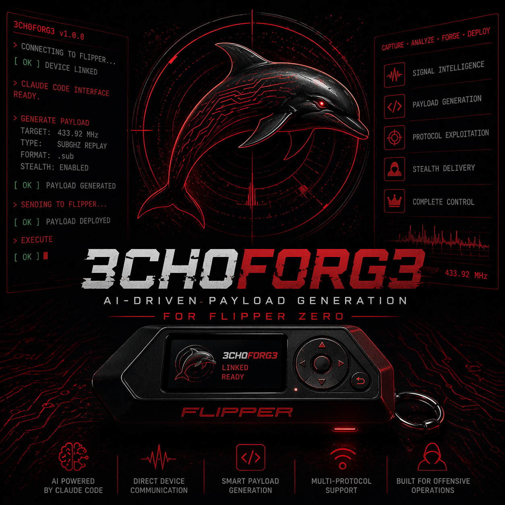
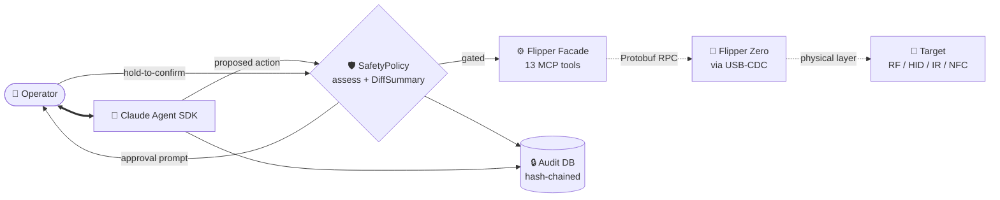

<p align="center">
  
</p>

<h1 align="center">3CH0F0RG3</h1>

<p align="center">
  <strong>AI-native payload forge for Flipper Zero.</strong><br>
  Natural language → advanced BadUSB / Sub-GHz / IR / NFC payloads.<br>
  Production-grade safety architecture for licensed red-team engagements.
</p>

<p align="center">
  
  
  
  
  
  
</p>

<p align="center">
  <code>CAPTURE  •  ANALYZE  •  FORGE  •  DEPLOY</code>
</p>

---

## Why 3CH0F0RG3

The Flipper Zero is the most capable hardware platform in modern red-team work — Sub-GHz, NFC, RFID, IR, BadUSB, BadBT, GPIO, all in one keychain device. **3CH0F0RG3 is the first AI-native operator interface for it.** You speak natural language, Claude composes the payload, the safety architecture audits every step, and the Flipper executes.

This is not a hobbyist toy. It's a payload-authoring framework engineered for licensed engagements, with the operator-accountability primitives that make it viable for serious work.

## Capabilities

|     | Capability                    | Description                                                                                                                |
| :-: | :---------------------------- | :------------------------------------------------------------------------------------------------------------------------- |
| 🧠  | **AI Powered by Claude Code** | Claude is the operator's force-multiplier — composes payloads, analyzes captures, walks through tradecraft                 |
| 📡  | **Direct Device Communication** | USB-CDC over a custom Protobuf RPC stack — no firmware mod, works with stock and Momentum                                 |
| 🛠️  | **Smart Payload Generation** | DuckyScript / `.sub` / `.ir` authoring with a 22-rule linter and natural-language composition                              |
| 🔌  | **Multi-Protocol Support**    | BadUSB, Sub-GHz, IR, NFC, RFID, iButton, GPIO — every Flipper primitive exposed as a typed MCP tool                        |
| 🎯  | **Built for Offensive Operations** | HIGH+hold gates, hash-chained audit, scope enforcement, OPERATOR-mode full-content logging for engagement deliverables |

## Architecture



Every Flipper-mutating action flows through:

- **`SafetyPolicy.assess()`** — risk classification (`LOW` / `MED` / `HIGH` / `BLOCKED`)
- **DiffSummary** on every write — operator sees the bytes before approving
- **`requires_hold`** gesture for physical actuation (BadUSB run, RF transmit) — irreversible operations get a press-and-hold confirmation, not a one-tap
- **Hash-chained audit DB** — tamper-evident record of every action, every approval, every result
- **OPERATOR-mode capture** — full payload bytes logged for engagement deliverables (opt-in via `--audit-mode=operator`); HOBBYIST mode stays hash-only for privacy

## Quick start

```powershell
git clone https://github.com/ascensionstrategist/echoforge.git
cd echoforge
python -m venv .venv
.venv\Scripts\activate
pip install -e ".[dev]"

# Pull Flipper protobuf definitions + generate Python bindings
python scripts/fetch_protos.py
python scripts/build_protos.py

# Run the test suite (385 tests, ~1.4s)
pytest

# Plug your Flipper in. Confirm the connection.
python -m echoforge.tools.ping

# Launch the AI REPL — natural-language Flipper control
python -m echoforge.tools.repl
```

## A 60-second demo

```
$ python -m echoforge.tools.repl
╭────────────────────────────────────────────────╮
│  echoforge connected to Webcam on COM7         │
│  type /help for commands, /quit to exit        │
╰────────────────────────────────────────────────╯
you › what's on my SD card?
▸ list_directory(path='/ext')
  ✓ 64 entries in /ext
[64 entries listed across badusb/, subghz/, infrared/, nfc/, ...]

you › what's my battery level?
▸ get_power_info()
  ✓ battery=100% charging=charged voltage=4.117V temp=26°C

you › blink the LED red three times
▸ led_control(color='r', level=255)  ▸ led_control(color='r', level=0)  ×3

you › /quit
session ended. 4 turns, 4 actions logged.
```

Every line above is real — captured from a live REPL session against a Flipper on COM7.

## The MCP tool surface

**13 typed payload tools** spanning the Flipper Zero capability matrix:

| Domain     | Tools |
| :--------- | :---- |
| **BadUSB** | `payload_badusb_validate`  •  `payload_badusb_create`  •  `payload_badusb_run` |
| **Sub-GHz** | `payload_subghz_list`  •  `payload_subghz_inspect`  •  `payload_subghz_retune`  •  `payload_subghz_import_capture`  •  `payload_subghz_tx` |
| **Infrared** | `payload_ir_list`  •  `payload_ir_inspect`  •  `payload_ir_import_capture`  •  `payload_ir_transmit` |
| **Library** | `payload_library_search` (cross-kind search with sidecar drift detection) |

Plus 33 lower-level Flipper primitives — storage, system, GPIO, application, hardware — for direct control.

Full schema, risk levels, and hold/diff requirements in [`docs/PHASE6_PAYLOAD_FORGE_API.md`](docs/PHASE6_PAYLOAD_FORGE_API.md).

## echoforge-flipper-mastery skill bundle

Ships a 6-skill Claude plugin with deep Flipper protocol expertise — gives Claude first-party knowledge so it writes valid payloads on the first try, not via trial-and-error:

| Skill | Domain |
| :---- | :----- |
| `echoforge-duckyscript` | DuckyScript 1.0/3.0 syntax, Flipper extensions, canonical patterns |
| `echoforge-subghz` | KeeLoq / Princeton / CAME / Nice Flo / Somfy / Security+ / Holtek |
| `echoforge-ir` | NEC / RC5 / RC6 / Sony SIRC / Pronto / Kaseikyo / Samsung |
| `echoforge-nfc-rfid` | MIFARE Classic+Ultralight+DESFire / HID Prox / iClass / EM4100 / iButton |
| `echoforge-hardware-debug` | JTAG / SWD / UART pinout & protocol reference |
| `echoforge-payload-defender` | Analytical mode — explains what an unknown payload does |

Install:

```powershell
cd skills\echoforge-flipper-mastery
claude plugin marketplace add .
claude plugin install echoforge-flipper-mastery
```

## DuckyScript linter

`echoforge-ducky-lint` — the only Flipper-dialect-aware DuckyScript linter (we checked).

```powershell
echoforge-ducky-lint /path/to/payload.txt          # human output
echoforge-ducky-lint --format=json    /path/...    # JSON for CI
echoforge-ducky-lint --format=github  /path/...    # GitHub annotations
echoforge-ducky-lint --list-rules                  # browse the 22 rules
```

22 rules across three severities — errors (E001–E007), warnings (W001–W011), info (I001–I004). Reachable via Claude through `payload_badusb_validate(strict=True)`. Canonical Hak5 / Flipper / Momentum payloads verified zero-finding clean.

## Documentation

| Document | Purpose |
| :------- | :------ |
| [`PHASE6_DECISIONS.md`](docs/PHASE6_DECISIONS.md) | Locked design decisions (operator overrides, risk-level mapping, sidecar schema) |
| [`PHASE6_PAYLOAD_FORGE_API.md`](docs/PHASE6_PAYLOAD_FORGE_API.md) | MCP tool inventory, schemas, error taxonomy |
| [`PHASE6_CONTENT_SAFETY.md`](docs/PHASE6_CONTENT_SAFETY.md) | Content-safety threat model (Phase 6) |
| [`PHASE6_REDTEAM_RESEARCH.md`](docs/PHASE6_REDTEAM_RESEARCH.md) | 54 cutting-edge attack research entries — papers, CVEs, POCs |
| [`PHASE6_PAYLOAD_RESEARCH.md`](docs/PHASE6_PAYLOAD_RESEARCH.md) | Top-tier Flipper payload repos for the library mirror |
| [`PHASE6_SKILL_RESEARCH.md`](docs/PHASE6_SKILL_RESEARCH.md) | Claude-skill ecosystem audit |
| [`PHASE6_CODE_REVIEW.md`](docs/PHASE6_CODE_REVIEW.md) | Phase 6 mandatory code-review record |
| [`DUCKY_LINTER_CODE_REVIEW.md`](docs/DUCKY_LINTER_CODE_REVIEW.md) | DuckyScript linter code-review record |
| [`PHASE7_FINSTRIKE_THREAT_MODEL.md`](docs/PHASE7_FINSTRIKE_THREAT_MODEL.md) | Phase 7 (FinStrike C2) threat model + safety integration |

## Roadmap

| Phase | Status | Highlights |
| :---- | :----- | :--------- |
| **1–3** Transport + RPC + Safety | ✅ Done | USB-CDC, Protobuf RPC, 71-test safety baseline |
| **4** Claude Agent SDK | ✅ Done | Live tool use verified on COM7 |
| **4.5** Hardening | ✅ Done | Stale-RPC fix, operator-mode audit, latent safety-gate-bypass bug caught |
| **5** Textual TUI | ⏸ Deprioritized | CLI is the right surface for now |
| **6** Payload Forge | ✅ Done | 13 tools, 22-rule linter, 385 tests, two review rounds |
| **7** FinStrike (C2 + Flipper-as-delivery) | 🔬 Design | Threat model on disk; architecture pending |
| **7+** Multi-step composer + bleeding-edge templates | 📋 Queued | Atoms + chains + compiler for natural-language composed payloads |

## Why the design matters

Most Flipper tooling relies on operator discipline alone — there's no architectural enforcement of audit, scope, or accountability. 3CH0F0RG3 inverts that:

- An action you didn't approve **cannot** run, even if Claude proposes it
- An action you approved **must** be audited, with the exact bytes captured under operator mode
- A physical actuation (typing, transmitting) **always** requires a press-and-hold confirmation, regardless of risk classification — physical-world side effects are unrecoverable
- The audit trail is **hash-chained** — tampering surfaces as a banner, not silent corruption

These are the primitives serious red-team frameworks (Sliver, Mythic, Havoc, Caldera) ship — adapted to the physical-layer wedge the Flipper opens up.

## Authorization

> ⚠️ **3CH0F0RG3 is engineered for licensed authorized red-team engagements** — internal-organization adversary emulation, contracted pentest work, and security research on systems you own or are authorized to assess.
>
> The operator-accountability architecture (audit chain, hold-to-confirm, scope enforcement) is the framework's technical accountability mechanism. But the framework relies on the operator acting under **written authorization**. Misuse is on the operator.

## License

**GPL-3.0-or-later.** Inherited from upstream [V3SP3R](https://github.com/elder-plinius/V3SP3R) (Android/Kotlin port — also GPL-3.0). Compatible with the Flipper firmware itself.

## Credits

- **Upstream:** [V3SP3R](https://github.com/elder-plinius/V3SP3R) by elder-plinius — original Android/Kotlin AI controller for Flipper Zero
- **Built with:** [Claude Agent SDK](https://github.com/anthropics/anthropic-sdk-python) by Anthropic
- **Architectural inspiration:** Sliver, Mythic, Havoc, Caldera
- **Hardware target:** [Flipper Zero](https://flipperzero.one/) running [Momentum firmware](https://momentum-fw.dev/)

---

<p align="center">
  <em>Built with Claude Code.  Hardened by code review.  Forged for serious work.</em>
</p>
